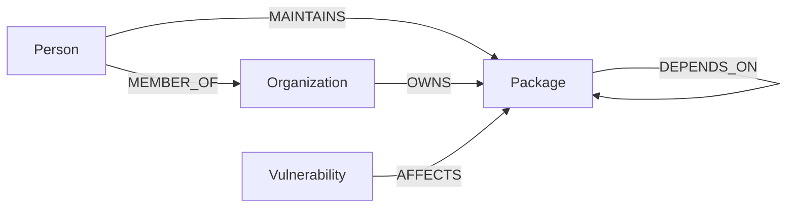

# DepGraph — an open-source dependency & maintainer-risk explorer

DepGraph is a small web app for exploring a software package registry as
a graph: what a package depends on, who maintains it, and how far a
vulnerability or a maintainer's departure would travel through the
ecosystem before it reaches you. It's backed by **CognoDB**, a managed
graph database that speaks openCypher over Bolt, accessed here through
the official Neo4j JavaScript driver.

> **Seed data note.** The dataset loaded by `npm run seed` is
> synthetic — generated by a small script, not scraped from the real
> npm registry. Package names, people, organizations and CVE-style
> identifiers are all fictional. The *shape* of the graph (a real
> dependency DAG, realistic bus-factor distribution, a handful of
> vulnerable packages) is what matters for demonstrating the queries.

---

## 1. Why a graph database?

The two questions this app is built around are:

- **"What does installing package X actually pull in, transitively —
  and who touches all of that code?"**
- **"If this one maintainer disappeared, how much of the ecosystem
  would feel it?"**

Both questions are about *reachability through relationships of
unknown, variable depth* — exactly what a relational schema is
awkward at and a property graph is native at:

| | Relational (SQL) | Graph (Cypher) |
|---|---|---|
| Transitive dependencies (N hops) | Recursive CTE, manual cycle guard, re-run per depth | One `[:DEPENDS_ON*1..6]` variable-length pattern |
| Vulnerability blast radius | Recursive CTE joined against a second table, per severity | One pattern chaining `DEPENDS_ON*` into `AFFECTS` |
| "Packages at risk if a sole maintainer leaves" | Two nested recursive queries (maintainer count = 1, then downstream fan-out) combined in application code | One Cypher statement: group, filter, traverse, aggregate |
| Shortest path between two arbitrary packages | Not expressible in standard SQL without a stored procedure | `shortestPath()` built into the query language |

None of this is impossible in SQL — production dependency-graph tools
like `npm ls` or GitHub's dependency graph exist — but it requires
either recursive CTEs that get slower and harder to read with every
extra hop, or precomputed closure tables that need to be rebuilt every
time an edge changes. In CognoDB, "how far does this reach" is the
same one- or two-line query regardless of whether the answer is 2 hops
or 20, and it stays correct as soon as new edges are written — no
closure table to maintain.

The other reason this domain fits a graph: the *interesting* unit of
analysis is never a single row, it's a **path** — the chain of
packages between a vulnerability and your app, or the chain connecting
two unrelated packages through a shared dependency. A graph database
returns paths as first-class results; a relational database returns
rows you'd have to stitch back into a path yourself.

---

## 2. Data model

```
(:Person {name, username})
      -[:MAINTAINS {since}]->        (:Package {name, ecosystem, description, stars, latestVersion})
      -[:MEMBER_OF]->                (:Organization {name})

(:Organization) -[:OWNS]->            (:Package)

(:Package) -[:DEPENDS_ON {versionRange, type}]-> (:Package)

(:Vulnerability {id, severity, summary, publishedDate})
      -[:AFFECTS {fixedInVersion}]-> (:Package)
```



Notes on the modeling choices:

- **`DEPENDS_ON` is a self-relationship on `Package`**, carrying
  `versionRange` and `type` (`direct`/`dev`) as edge properties rather
  than a join table — this is what makes the variable-length
  traversals possible in the first place.
- **`MAINTAINS` and `AFFECTS` also carry edge properties**
  (`since`, `fixedInVersion`) — information that belongs to the
  *relationship*, not either endpoint, which a graph model expresses
  directly instead of via a join table with extra columns.
- Constraints (`UNIQUE` on `Package.name`, `Person.username`,
  `Organization.name`, `Vulnerability.id`) are created by the seed
  script so lookups by these keys use an index.

---

## 3. Set up CognoDB Cloud

1. Sign up at [console.cognodb.com/signup](https://console.cognodb.com/signup) (free, no card).
2. Create a free **c0** instance and pick a region — it provisions in under a minute.
3. Copy the connection URI (`bolt+s://<instance-id>.databases.cognodb.cloud`)
   and the generated password for user `cognodb`. **The password is
   shown once** — save it now.

## 4. Run it locally

```bash
git clone <this-repo-url>
cd depgraph
npm install
cp .env.example .env
# edit .env with your COGNODB_URI / COGNODB_USERNAME / COGNODB_PASSWORD

npm run seed     # loads the synthetic dataset (~180 packages, ~90 people, ~213 dependency edges)
npm start        # serves the app on http://localhost:4000
```

Open `http://localhost:4000`. The connection indicator in the top-right
corner shows whether the server can currently reach CognoDB; if it
can't, the UI still loads and every API call returns a `503` with a
plain-language reason instead of a stack trace.

No build step — the frontend is static HTML/CSS/vanilla JS served
directly by the Express app, so there's nothing to compile.

## 5. Project structure

```
server/
  index.js            Express app: static file serving, health check, error handling
  db.js               Single Neo4j driver instance + query helpers
  queries/cypher.js    Every Cypher statement used by the app, in one place
  routes/              REST endpoints: packages, risk dashboard, path finder
scripts/
  seed-data.js         Synthetic dataset generator (deterministic, seeded RNG)
  seed.js              Loads the dataset into CognoDB via parameterised UNWIND writes
public/
  index.html, css/, js/  Static single-page frontend (hash router, no build step)
```

## 6. The main queries, explained

All queries live in `server/queries/cypher.js` and are called with
parameters through the official driver — nothing is built by
concatenating a package name into a query string.

- **`getTransitiveDependencies`** *(multi-hop, 1–6 hops)* — everything
  a package pulls in, directly or through other packages, using
  `[:DEPENDS_ON*1..6]` and returning each package with the shortest
  depth at which it's reached.
- **`getTransitiveDependents`** *(multi-hop)* — the reverse: a
  package's full "blast radius," i.e. everything that would be
  affected if it broke.
- **`getInheritedVulnerabilities`** *(multi-hop, relationally awkward)*
  — chains a variable-length `DEPENDS_ON` traversal into an `AFFECTS`
  edge to find vulnerabilities anywhere upstream of the package being
  viewed, not just ones that hit it directly.
- **`getBusFactorRisk`** *(relationally awkward aggregate)* — finds
  packages with exactly one maintainer, then for each one counts how
  many other packages transitively depend on it. This is a
  group-by-having combined with a per-row variable-length traversal —
  two nested recursive queries' worth of SQL collapsed into one
  statement.
- **`getShortestPath`** — uses Cypher's built-in `shortestPath()` to
  find the shortest dependency chain between two named packages.


## 7. Engineering notes

- Connection details are read from environment variables only; `.env`
  is gitignored, and `.env.example` documents what's needed.
- The server verifies connectivity once at boot and logs a clear
  warning if CognoDB is unreachable, then guards every `/api/*` route
  so requests fail with a `503` and a plain-language reason rather
  than a raw driver error or an unhandled crash.
- Every write in the seed script and every read in the API layer uses
  parameterised Cypher (`$param`) — no query is ever built by string
  concatenation.
